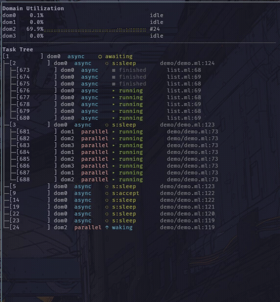

# mtbox, some tools to monitor [Miou][miou] applications

`mtbox` is a suite of software tools designed to monitor Miou applications.
There are three tools:
- `recd`: used to generate a trace (in the Chrome Trace Event Format) which the
  user can analyse using [Perfetto][perfetto], for example.
- `mtop`: a TUI that allows you to monitor a Miou application in real time. This
  can be useful for gaining a clear understanding of what a Miou programme is
  doing. This can be useful for identifying potential tasks that never end.
- `diag`: a tool for understanding the errors that a Miou application may throw
  if the user does not follow Miou's rules (in addition, whenever an exception
  such as `Still_has_children` is thrown).

These tools facilitate the debugging of a Miou application and make judicious
use of both its own trace system and that provided by OCaml. However, such a
system has limitations: indeed, the OCaml event system can _lose_ events, and
these tools may therefore miss information that could be important for
interpreting events (and errors).

In short, these tools are not designed to evaluate Miou applications under heavy
load (such as, for example, a benchmark).

## diag

Miou has a few rules regarding task and resource management which, if not
followed, will trigger an _uncatchable_ exception when the programme is
running. We are referring here to the following exceptions:
- `Still_has_children`: when a task terminates without having waited for (or
  cancelled) all its subtasks
- `Not_a_child`: when attempting to wait for a task that does not belong to us
  (with which we have no direct parent-child relationship)
- `Resource_leaked`: when we have not released the resource associated with a
  task that owns it, even though that task has finished
- `Not_owner`: when attempting to manipulate a resource that does not belong to
  our current task.

It can be difficult to know where these errors originate, and the `diag` tool
provides a detailed report if such an exception is raised by your programme.
Simply add the Miou and OCaml trace system to your programme and run it with
diag. Here is an example:
```shell
$ cat >main.ml <<EOF
>let () =
>  Miou.Trace.set_reporter Miou_runtime_events.reporter;
>  Miou_unix.run @@ fun () ->
>  let prm = Miou.async @@ fun () ->
>    let _ = Miou.async ignore in (* <- Error here! *)
>    print_endline "done" in
>  Miou.await_exn prm
>EOF
$ ocamlfind opt -linkpkg -package miou.unix,miou.runtime_events main.ml
$ mtbox.diag -- ./a.out
diag: attached to pid=111xxx dir=/tmp
done
a.out: [0][ERROR] [0] failed with "Miou.Still_has_children"
Fatal error: exception Miou.Still_has_children
[2026-04-21T12:13:44Z] ERROR Still_has_children  
        task #2 main.ml:4 finished while still holding 1 unawaited child (fix: await or cancel every child before returning)
        parent chain: #2
        - child #3 main.ml:5 (parent=#2, runner=dom0)
diag: exit (tasks seen=2, lost=0)
```

## mtop

<p align="center">
  
</p>

<hr />

`mtop` is an (experimental) application that provides a dynamic view of a Miou
programme. It allows you to monitor task execution and the usage of domains and
resources. You can see an example by running:
```shell
$ mtbox.mtop -- dune exec ./demo/demo.exe
```

You can exit the programme by pressing ESC. The `demo` programme launches
several tasks as well as an 'echo' server (you can follow [the
tutorial][miou-tutorial] on how to implement an echo server with Miou). The
programme also requires at least 4 domains. It is simply designed to
demonstrate `mtop`.

The OCaml runtime events transport is a fixed-size ring buffer as a file,
bursts of activity can make the target overwrite events faster than `mtop` can
read them. When that happens, the OCaml runtime reports the number of lost
events and `mtop` displays a red `LOST N` badge in the status bar. State
reconstructed after a loss may be briefly out of sync until the next
authoritative event arrives.

`mtop` was developed using [notty-miou][notty-miou] (as well as [lwd][lwd]) as
a demonstration of what can be achieved in terms of TUI with Miou. It is a good
example of a programme that can be written in OCaml, but we would like to warn
users that it is purely for cosmetic purposes: `recd` and `diag` are more
interesting and useful than `mtop`.

[miou-tutorial]: https://robur-coop.github.io/miou/echo.html
[notty-miou]: https://github.com/robur-coop/notty-miou
[lwd]: https://github.com/let-def/lwd
[miou]: https://github.com/robur-coop/miou
[perfetto]: https://perfetto.dev/
